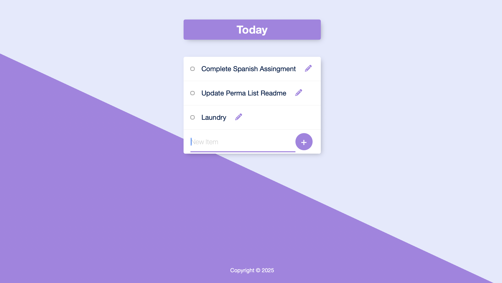

# 📝 PermaList

PermaList is a simple **to-do list web app** built with **Node.js, Express, EJS, and PostgreSQL**.  
It allows you to add, edit, and delete tasks, with all data persisted in a PostgreSQL database.

---

## 🚀 Features
- Add new tasks
- Edit existing tasks inline
- Delete tasks by checking them off
- Persistent storage using PostgreSQL
- Clean UI powered by EJS templates and CSS
- Modular structure for easy extension

---

## 🛠️ Tech Stack
- **Backend:** Node.js, Express
- **Database:** PostgreSQL
- **Templating:** EJS
- **Styling:** CSS (with static assets served from `/public`)

---

## User Interface

